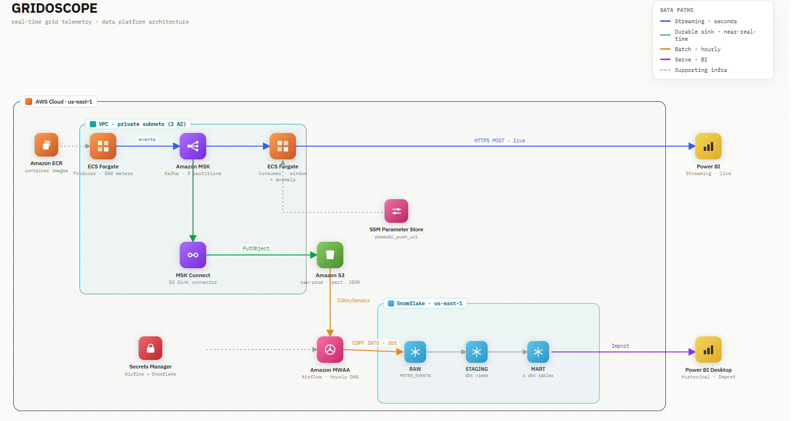
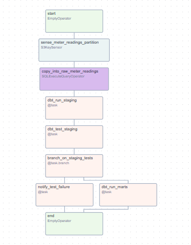
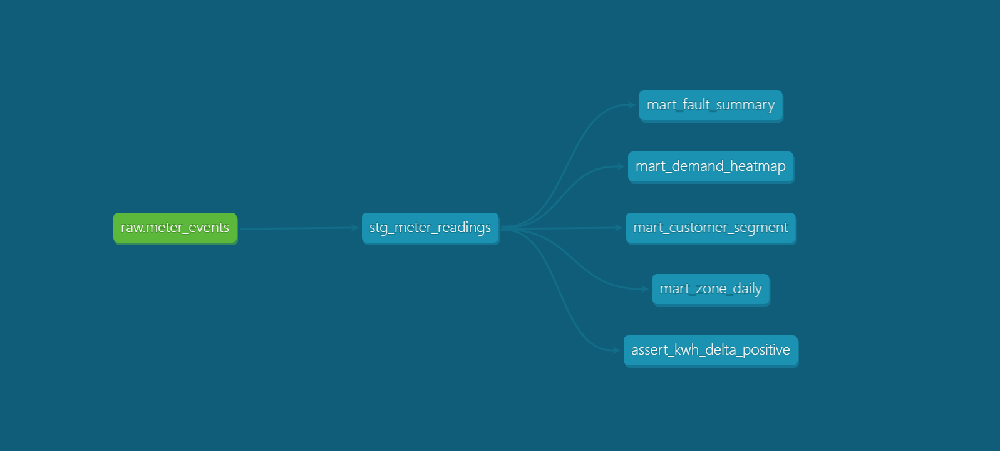
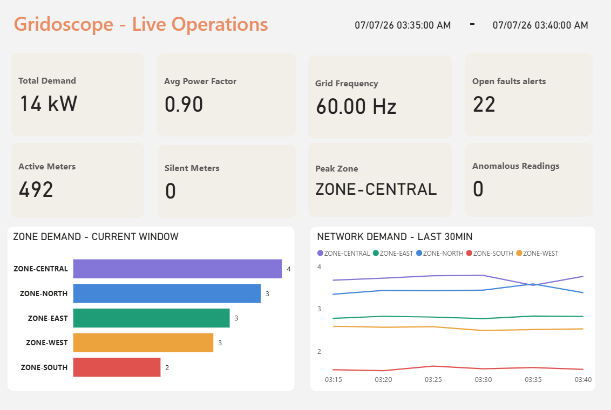
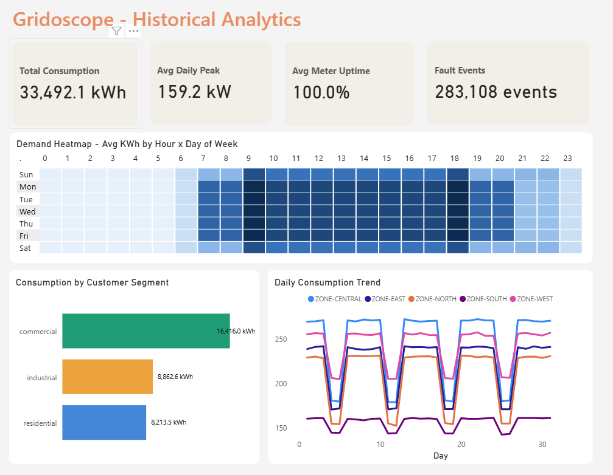

# Gridoscope

> City-scale IoT energy monitoring pipeline — 500 smart meters, real-time streaming, and a full batch analytics stack, end to end on AWS.


---

## Table of Contents

1. [Overview](#1-overview)
2. [Architecture](#2-architecture)
3. [Tech Stack](#3-tech-stack)
4. [Repository Layout](#4-repository-layout)
5. [The Meter Simulation](#5-the-meter-simulation)
6. [Streaming Pipeline](#6-streaming-pipeline)
   - [The Producer](#the-producer)
   - [Kafka Topology](#kafka-topology)
   - [Aggregation Consumer](#aggregation-consumer)
   - [Power BI Streaming Dataset](#power-bi-streaming-dataset)
7. [Batch Pipeline](#7-batch-pipeline)
   - [MSK Connect S3 Sink](#msk-connect-s3-sink)
   - [Airflow on MWAA](#airflow-on-mwaa)
   - [Snowflake Ingestion](#snowflake-ingestion)
   - [dbt Transformations](#dbt-transformations)
   - [Power BI Historical Report](#power-bi-historical-report)
8. [Infrastructure](#8-infrastructure)
9. [Dashboards](#9-dashboards)
10. [Local Development](#10-local-development)
11. [AWS Deployment](#11-aws-deployment)
12. [CI/CD](#12-cicd)
13. [Configuration Reference](#13-configuration-reference)
14. [Key Engineering Decisions](#14-key-engineering-decisions)
15. [Challenges and What I'd Improve](#15-challenges-and-what-id-improve)

---

## 1. Overview

Gridoscope simulates a 500-meter smart grid network spanning five city zones and runs a complete data engineering pipeline from real-time streaming through historical analytics. The project was deliberately built to require fluency in both the streaming and batch paths — not a toy example that covers one pattern in isolation, but a unified system where both paths do real work and feed real dashboards.

On the **streaming side**: a Python asyncio producer simulates 500 meters and publishes readings to Apache Kafka (AWS MSK). A stateful consumer group maintains per-zone 5-minute tumbling windows, computes demand metrics and per-hour EMA anomaly scores, and pushes results to a live Power BI streaming dashboard that updates every few seconds.

On the **batch side**: an MSK Connect S3 Sink Connector durably writes every raw event to S3, partitioned by simulated date and hour. An Airflow DAG on MWAA picks up each hour's partition, loads it into Snowflake's raw layer via `COPY INTO`, then triggers dbt staging and mart transformations that back a Power BI historical analytics report covering demand heatmaps, customer segment breakdowns, zone trends, and meter health scorecards.

Everything runs on AWS. All infrastructure is defined in Terraform.

---

## 2. Architecture



### Streaming path (real-time)

```
ECS Fargate (Python asyncio producer)
  └── 500 meter coroutines → AWS MSK (5 partitions, zone-keyed)
        ├── ECS Fargate (aggregation consumer group)
        │     └── 5-min tumbling windows → Power BI streaming dataset
        └── MSK Connect (S3 Sink Connector)
              └── S3 (event-time partitioned by date/hour)
```

### Batch path (historical)

```
S3: raw/meter.readings/year=YYYY/month=MM/day=DD/hour=HH/
  └── MWAA Airflow (hourly DAG: schedule "15 * * * *")
        ├── S3KeySensor  →  sense partition completeness
        ├── COPY INTO    →  Snowflake raw layer
        ├── dbt run staging  →  dbt test staging
        └── dbt run marts  →  Power BI Desktop report
```

---

## 3. Tech Stack

| Layer | Technology | Role |
|---|---|---|
| Simulation | Python 3.11 · asyncio | 500-meter fleet, state machines, event generation |
| Messaging | Apache Kafka (AWS MSK) | Durable event stream, 5 partitions (one per zone) |
| Stream processing | Python · aiokafka | Stateful 5-min tumbling windows, EMA anomaly detection |
| Sink connector | MSK Connect (Confluent S3 Sink) | Continuously drains Kafka → S3, event-time partitioned |
| Object storage | Amazon S3 | Raw event archive, Hive-partitioned source for batch path |
| Orchestration | Apache Airflow 2.10 (MWAA) | Hourly load DAG, dbt triggers, test-branching logic |
| Warehouse | Snowflake | Raw, staging, and mart layers |
| Transformation | dbt · dbt-snowflake | Staging cleaning + 4 mart models |
| Compute | ECS Fargate | Containerized producer and consumer |
| Container registry | Amazon ECR | Docker image storage |
| Infrastructure | Terraform | Full IaC — VPC, MSK, ECS, MWAA, Snowflake, S3 |
| Visualization | Power BI | Live streaming dashboard + historical analytics report |

---

## 4. Repository Layout

```
gridoscope/
├── producers/                    # Kafka producer + meter simulation engine
│   ├── engine.py                 # Top-level coordinator — wires components, runs asyncio.gather
│   ├── meter_state_machine.py    # Per-meter state + event generation
│   ├── meter_profile.py          # Static meter config (type, interval, consumption)
│   ├── scenario_engine.py        # Injects time-based effects (heatwave, peak events)
│   ├── kafka_producer.py         # aiokafka wrapper with routing + throughput metrics
│   ├── msk_iam_auth.py           # Sync/async bridge for MSK IAM token auth
│   ├── config.py                 # All tuneable parameters in one place
│   └── Dockerfile
│
├── consumers/                    # Kafka consumer group + aggregation pipeline
│   ├── runner.py                 # Spawns 5 ZoneConsumer coroutines (one per partition)
│   ├── consumer.py               # Per-zone consumer (manual partition assignment)
│   ├── aggregator.py             # Stateful 5-min tumbling windows, per-zone metrics
│   ├── anomaly.py                # Per-hour EMA anomaly detector
│   ├── powerbi_sink.py           # HTTP push to Power BI streaming dataset
│   ├── msk_iam_auth.py           # Same sync/async bridge as producer side
│   ├── config.py                 # Consumer configuration
│   └── Dockerfile
│
├── airflow/
│   ├── dags/
│   │   ├── gridoscope_hourly_load.py   # Main pipeline DAG
│   │   └── sql/copy_into_raw.sql       # Snowflake COPY INTO statement
│   └── requirements.txt
│
├── gridoscope_dbt/               # dbt project
│   ├── models/
│   │   ├── staging/
│   │   │   └── stg_meter_readings.sql      # Typed, cleaned, enriched from raw VARIANT
│   │   └── mart/
│   │       ├── mart_demand_heatmap.sql      # Zone × hour demand grid
│   │       ├── mart_zone_daily.sql          # Daily zone totals and trends
│   │       ├── mart_customer_segment.sql    # Residential / commercial / industrial breakdown
│   │       └── mart_fault_summary.sql       # Meter health scorecard
│   ├── tests/assert_kwh_delta_positive.sql
│   ├── macros/generate_schema_name.sql
│   └── dbt_project.yml
│
├── infra/                        # Terraform — full AWS + Snowflake IaC
│   ├── main.tf                   # Root module — wires all child modules
│   ├── dev.tfvars                # Development variable values (gitignored)
│   └── modules/
│       ├── networking/           # VPC, subnets, NAT gateway, VPC endpoints
│       ├── msk/                  # MSK cluster, broker config, security groups
│       ├── msk_connect/          # MSK Connect cluster + S3 Sink Connector
│       ├── ecs_cluster/          # Fargate cluster + IAM execution roles
│       ├── ecs_service/          # Task definitions and services (producer + consumer)
│       ├── mwaa/                 # MWAA environment + IAM + KMS key
│       ├── storage/              # S3 bucket + lifecycle rules
│       ├── snowflake/            # Storage integration, external stage, raw table
│       └── ecr/                  # ECR repositories for producer and consumer images
│
└── docker-compose.dev.yml        # Local Kafka for development
```

---

## 5. The Meter Simulation

The simulation models 500 meters distributed across five city zones (ZONE-NORTH, ZONE-SOUTH, ZONE-EAST, ZONE-WEST, ZONE-CENTRAL) at a realistic customer mix:

| Customer Type | Fleet Share | Meters | Reading Interval |
|---|---|---|---|
| Residential | 70% | 350 | 5 minutes |
| Commercial | 24% | 120 | 2 minutes |
| Industrial | 6% | 30 | 1 minute |

Each meter runs as an independent probabilistic state machine cycling through `NORMAL`, `DEGRADED`, `FAULT`, and `SILENT` states. Fault probability compounds the meter's base rate, its age, simulated temperature stress, and any active scenario multiplier. Silent meters produce no events — their absence is detected by the consumer.

A shared `SimulationClock` and a `speed_multiplier` parameter let the entire fleet run at any time acceleration:

```
speed_multiplier = 1    →  real time         │  5-min windows close every 5 real minutes
speed_multiplier = 10   →  10× faster        │  5-min windows close every 30 real seconds
speed_multiplier = 60   →  60× faster        │  5-min windows close every 5 real seconds
speed_multiplier = 100  →  100× faster       │  5-min windows close every 3 real seconds
```

A background `ScenarioEngine` coroutine injects time-of-day effects — evening demand peaks, heatwave fault amplification, zone-wide outages — into subsets of the fleet at configured simulation hours.

---

## 6. Streaming Pipeline

### The Producer

`producers/engine.py` is the top-level coordinator. It generates the fleet, creates one `MeterStateMachine` per meter, builds a zone-to-meters mapping for the `ScenarioEngine`, then launches all 500 meter coroutines plus the scenario engine via `asyncio.gather()`.

Each meter runs a tight async loop:

```python
while True:
    event = state_machine.generate_event()    # None when meter is SILENT
    if event:
        await producer.send_event(event)      # suspends this coroutine, others keep running
    await asyncio.sleep(interval / speed_multiplier + jitter)
```

All 500 coroutines multiplex on a single event loop thread. While one coroutine awaits its sleep interval, others run. While one awaits the Kafka `send()`, others run. This is how 500-meter concurrency is achieved without 500 threads.

`GridoscopeProducer` wraps `AIOKafkaProducer` and handles:

- **MSK IAM authentication** — SASL_SSL / OAUTHBEARER with a sync/async bridge (see [Key Engineering Decisions](#14-key-engineering-decisions))
- **Zone-based partition routing** — `zone_id` as the Kafka message key guarantees deterministic partition assignment
- **Simulated-time record timestamps** — so the S3 Sink partitions by simulation hour, not wall clock
- **Per-batch snappy compression** — JSON payloads compress ~50% at minimal CPU cost

### Kafka Topology

`meter.readings` has 5 partitions — one per city zone. Because `zone_id` is the message key, Kafka's key-based routing guarantees that all readings from a given zone always land on the same partition. This consistency is what makes stateful per-zone aggregation possible without cross-consumer coordination.

```
meter.readings  (5 partitions)
  ├── partition 0  →  ZONE-NORTH
  ├── partition 1  →  ZONE-SOUTH
  ├── partition 2  →  ZONE-EAST
  ├── partition 3  →  ZONE-WEST
  └── partition 4  →  ZONE-CENTRAL
```

### Aggregation Consumer

`consumers/runner.py` spawns 5 `ZoneConsumer` coroutines — one per partition — all sharing a single `PowerBISink` instance (one aiohttp session, one connection pool). Each consumer uses **manual partition assignment** (`assign()` not `subscribe()`) to prevent Kafka rebalancing from evicting in-memory aggregation state.

**Event-time tumbling windows:** Windows are driven by the `timestamp` field inside each event (simulation time), not wall-clock time. A window closes when the aggregator sees an event with a timestamp ≥ `window_start + 5 minutes`. This means all five zones emit the same simulated time slot on every window close, regardless of when messages actually arrived.

Each `WindowBucket` accumulates the following fields per zone per window:

| Field | Computation |
|---|---|
| `total_kwh` | Sum of `kwh_delta` across all meters in the zone |
| `avg_power_kw` / `peak_power_kw` | Mean and max of `power_kw` readings |
| `avg_voltage` · `avg_frequency_hz` · `avg_power_factor` | Mean of readings |
| `active_meter_count` | Distinct meter IDs seen in the window |
| `silent_meter_count` | Expected meter count minus active count |
| `degraded_count` · `fault_count` · `anomaly_count` | Count of readings in those states |
| `demand_vs_prev_window_pct` | % change in `total_kwh` vs. the previous window |

**Per-hour EMA anomaly detection:** `AnomalyDetector` maintains a separate exponential moving average baseline per hour of day (24 independent baselines per meter). A reading is flagged anomalous if its `kwh_delta` exceeds 4× the EMA for that hour. When a spike is detected, the EMA is **frozen** — the spike is not incorporated into the baseline, so one bad reading doesn't permanently shift what "normal" looks like for that hour.

### Power BI Streaming Dataset

The streaming dataset is configured in Power BI with 15 fields matching the `ZoneAggregate` schema. The consumer pushes one JSON row per zone per closed window via HTTP POST to the dataset's push URL. At `speed_multiplier=100`, all 5 zones push simultaneously every ~3 real seconds.

---

## 7. Batch Pipeline

### MSK Connect S3 Sink

An MSK Connect cluster runs the Confluent S3 Sink Connector against `meter.readings`. Key configuration:

- **Partitioner:** `TimeBasedPartitioner` using the Kafka record timestamp, which the producer stamps with simulated time (not wall clock)
- **S3 path pattern:** `raw/meter.readings/year=YYYY/month=MM/day=DD/hour=HH/*.json`
- **Flush:** 1,000 records or 60 seconds — whichever comes first
- **Format:** JSON Lines (one event object per line)

The result is a Hive-partitioned archive of every raw event partitioned by simulated date and hour, which Airflow reads to know which partitions to sense and load.

### Airflow on MWAA



The `gridoscope_hourly_load` DAG runs at 15 minutes past each hour — giving the S3 Sink time to flush the previous hour's data before loading. `catchup=False`, `max_active_runs=1`.

```
start
  └── sense_meter_readings_partition   (S3KeySensor — waits for *.json in the hour's prefix)
        └── copy_into_raw_meter_readings  (SQLExecuteQueryOperator → COPY INTO Snowflake)
              └── dbt_run_staging
                    └── dbt_test_staging
                          └── branch_on_staging_tests
                                ├── dbt_run_marts          (on test success)
                                └── notify_test_failure    (on test failure)
                                      └── end
```

> **dbt venv isolation on MWAA 2.10.3:** MWAA ships with pinned versions of `pathspec` and `isodate` that conflict with `dbt-core 1.7.x`'s dependency requirements. The `_run_dbt()` helper creates an isolated virtualenv at `/tmp/dbt_venv` on first use (per-worker lifecycle) and installs `dbt-snowflake~=1.7.0` into it in complete isolation from MWAA's Python environment. The DAG directory is read-only on MWAA (S3-synced), so dbt logs and compiled artifacts are redirected to `/tmp`.

### Snowflake Ingestion

The raw layer is a single table — `GRIDOSCOPE_RAW.PUBLIC.METER_READINGS_RAW` — with a `VARIANT` column holding the raw JSON. The COPY INTO statement loads from an S3 external stage, filtering by the current logical hour's path prefix.

Snowflake accesses S3 through a **storage integration** with a cross-account IAM trust relationship. Snowflake assumes a role in the Gridoscope AWS account — no access keys exist anywhere in the pipeline. The trust relationship is established via the `snowflake` Terraform module and requires one manual step after initial `terraform apply` (see [AWS Deployment](#11-aws-deployment)).

### dbt Transformations



**`stg_meter_readings`** (view) parses the VARIANT JSON into typed columns, casts timestamps, derives `zone` from `zone_id`, adds `hour_of_day` and `is_weekend`, and applies column-level data tests from `schema.yml`. It is the single source of truth for all four mart models.

| Mart Model | Powers | Grain | Key Metrics |
|---|---|---|---|
| `mart_demand_heatmap` | Demand heatmap visual | zone × hour | `avg_kwh_delta`, `avg_power_kw` |
| `mart_zone_daily` | Zone trend line chart | zone × day | `total_kwh`, `peak_power_kw`, `day_over_day_pct` |
| `mart_customer_segment` | Segment breakdown | customer_type × day | `total_kwh`, `avg_power_factor`, `fault_rate` |
| `mart_fault_summary` | Meter health scorecard | meter_id × day | `fault_count`, `silent_count`, `anomaly_rate` |

Staging models materialize as **views** (always fresh on query). Mart models materialize as **tables** (rebuilt on each dbt run). The custom `generate_schema_name` macro writes staging models to a `_staging` schema and mart models to a `_mart` schema in Snowflake.

### Power BI Historical Report

Connected to Snowflake mart models via DirectQuery, refreshed after each dbt mart run — see [Dashboards](#9-dashboards) for full detail.

---

## 8. Infrastructure

All infrastructure is defined in Terraform, organized into 9 child modules:

| Module | AWS Service | What it provisions |
|---|---|---|
| `networking` | VPC | VPC, 2 public + 2 private subnets, NAT gateway, S3 gateway endpoint, 5 interface endpoints (ECR API, ECR DKR, CloudWatch Logs, STS, SSM) |
| `msk` | Amazon MSK | 2-broker Kafka cluster, broker security groups, IAM auth config, TLS in-transit encryption |
| `msk_connect` | MSK Connect | Worker configuration cluster, S3 Sink Connector plugin and connector resource |
| `ecs_cluster` | ECS | Fargate cluster, task execution role, SSM read policy |
| `ecs_service` | ECS | Task definitions and services for producer and consumer containers |
| `mwaa` | Amazon MWAA | Airflow 2.10.3 environment, supporting S3 bucket for DAGs, KMS key, VPC networking |
| `storage` | S3 | Raw event bucket with SSE-S3, versioning, and a 90-day lifecycle rule |
| `snowflake` | Snowflake | Storage integration, external S3 stage, raw schema and VARIANT table |
| `ecr` | ECR | Repositories for `gridoscope-producer` and `gridoscope-consumer` |

**Networking:** All compute (ECS tasks, MSK brokers, MSK Connect workers, MWAA scheduler/workers) lives in private subnets with no public IPs. Traffic to AWS APIs stays within the VPC via interface endpoints — it never traverses the NAT gateway, keeping data transfer costs near zero. The NAT gateway handles outbound internet traffic for things like the consumer's Power BI HTTP pushes.

**IAM:** MSK uses IAM-based authentication (SASL_SSL / OAUTHBEARER) — no static Kafka credentials anywhere. ECS task roles are scoped by resource. Snowflake accesses S3 through a cross-account IAM trust relationship via the storage integration — no access keys exist in the pipeline.

**Security group wiring:** The MSK module and ECS cluster module create security groups that need to reference each other (MSK SGs allow inbound from ECS tasks; ECS task SGs allow outbound to MSK). This creates a cross-module dependency cycle in Terraform that is resolved by wiring the security group IDs at the root module level rather than inside either child module.

---

## 9. Dashboards

### Live Operational Dashboard



Updated every 3–5 real seconds at `speed_multiplier=100`. Driven by the aggregation consumer pushing `ZoneAggregate` objects to a Power BI streaming dataset over HTTP.

The dashboard shows two rows of KPI cards across the top: **Total Demand**, **Avg Power Factor**, **Grid Frequency**, and **Open Fault Alerts** in the first row; **Active Meters**, **Silent Meters**, **Peak Zone**, and **Anomalous Readings** in the second. Below are two charts: **Zone Demand — Current Window** (a horizontal bar chart ranking the five zones by kW demand in the last closed 5-minute window) and **Network Demand — Last 30 Min** (a multi-line chart with one line per zone, showing how demand has moved across the last six windows).

### Historical Analytics Report



Connected to Snowflake mart models via DirectQuery and updated after each daily dbt run.

The report page shows four KPI tiles: **Total Consumption**, **Avg Daily Peak**, **Avg Meter Uptime**, and **Fault Events**. Below is a **Demand Heatmap** (a 7-day × 24-hour grid showing average kWh intensity by day of week and hour — weekday business hours darken noticeably against overnight and weekend cells), a **Consumption by Customer Segment** bar chart (commercial, industrial, and residential totals), and a **Daily Consumption Trend** line chart with one line per zone plotted over the full date range.

---

## 10. Local Development

### Prerequisites

- Docker + Docker Compose
- Python 3.11+
- A Snowflake account (free trial sufficient for dbt runs)

### Start local Kafka

```bash
docker-compose -f docker-compose.dev.yml up -d
```

Starts a single-broker Kafka cluster on `localhost:9092`. Topics are created automatically on first producer connect.

### Run the producer

```bash
cd producers
pip install -r requirements.txt

# Fast dev run: 50 meters, 100× speed, fixed seed
TOTAL_METERS=50 SPEED_MULTIPLIER=100 python engine.py
```

### Run the consumer

Open a second terminal:

```bash
cd consumers
pip install -r requirements.txt

# Dry mode — aggregates print to terminal, no Power BI push
SPEED_MULTIPLIER=100 python runner.py

# With Power BI enabled
POWERBI_PUSH_URL="https://api.powerbi.com/beta/.../rows" \
POWERBI_ENABLED=true \
SPEED_MULTIPLIER=100 \
python runner.py
```

Window aggregates appear in the consumer terminal within seconds. At `speed_multiplier=100` you should see one aggregate per zone closing roughly every 3 real seconds.

### Run dbt locally

```bash
cd gridoscope_dbt
pip install dbt-snowflake~=1.7.0

# Fill in your Snowflake credentials in profiles.yml first
dbt run  --select staging
dbt test --select staging
dbt run  --select mart
```

---

## 11. AWS Deployment

### Prerequisites

- Terraform ≥ 1.5
- AWS CLI configured with credentials that have sufficient permissions
- A Snowflake account with `ACCOUNTADMIN` access (required for storage integration setup)

### 1. Provision infrastructure

```bash
cd infra
terraform init
terraform plan  -var-file=dev.tfvars
terraform apply -var-file=dev.tfvars
```

**Snowflake storage integration:** No manual steps required. The Terraform Snowflake provider creates the storage integration, then exposes the IAM user ARN and external ID that Snowflake assigned as computed attributes. The `snowflake` module references those directly when creating the AWS IAM role trust policy — all in a single `terraform apply`. The circular dependency is broken by pre-computing the role ARN from known values (`aws_caller_identity` + `var.iam_role_name`) rather than waiting for the role resource to exist first.

### 2. Build and push Docker images

```bash
# Authenticate to ECR
aws ecr get-login-password --region us-east-1 | \
  docker login --username AWS --password-stdin \
  <account-id>.dkr.ecr.us-east-1.amazonaws.com

# Producer
docker build -t gridoscope-producer ./producers
docker tag  gridoscope-producer:latest \
  <account-id>.dkr.ecr.us-east-1.amazonaws.com/gridoscope-producer:latest
docker push <account-id>.dkr.ecr.us-east-1.amazonaws.com/gridoscope-producer:latest

# Consumer
docker build -t gridoscope-consumer ./consumers
docker tag  gridoscope-consumer:latest \
  <account-id>.dkr.ecr.us-east-1.amazonaws.com/gridoscope-consumer:latest
docker push <account-id>.dkr.ecr.us-east-1.amazonaws.com/gridoscope-consumer:latest
```

Force ECS to pick up the new images immediately:

```bash
aws ecs update-service --cluster gridoscope-dev \
  --service gridoscope-producer --force-new-deployment
aws ecs update-service --cluster gridoscope-dev \
  --service gridoscope-consumer --force-new-deployment
```

### 3. Sync DAGs to MWAA

```bash
aws s3 sync airflow/dags/ s3://<mwaa-bucket>/dags/ --delete
```

Airflow picks up DAG changes within 30–60 seconds of the S3 sync.

Add the Snowflake connection in the Airflow UI (or via CLI):

| Field | Value |
|---|---|
| Connection ID | `gridoscope_snowflake_dbt_prod` |
| Connection type | Snowflake |
| Account | `<your-snowflake-account>` |
| Login | `<dbt-user>` |
| Password | `<dbt-password>` |

This connection is resolved at task execution time from Airflow's backend (which is backed by Secrets Manager on MWAA) — no credentials exist in the DAG file.

---

## 12. CI/CD

A GitHub Actions workflow handles image builds and deployment on every push to `main`. The pipeline has two jobs:

**`build-and-push`** — builds Docker images for the producer and consumer, pushes them to ECR, and forces new ECS deployments:

```bash
# Authenticate to ECR
aws ecr get-login-password --region us-east-1 | \
  docker login --username AWS --password-stdin \
  <account-id>.dkr.ecr.us-east-1.amazonaws.com

# Build and push both images
docker build -t gridoscope-producer ./producers && docker push ...
docker build -t gridoscope-consumer ./consumers && docker push ...

# Force ECS to pick up the new images
aws ecs update-service --cluster gridoscope-dev \
  --service gridoscope-producer --force-new-deployment
aws ecs update-service --cluster gridoscope-dev \
  --service gridoscope-consumer --force-new-deployment
```

**`sync-dags`** — syncs the `airflow/dags/` directory to the MWAA S3 bucket after the build job succeeds:

```bash
aws s3 sync airflow/dags/ s3://<mwaa-bucket>/dags/ --delete
```

MWAA picks up DAG changes within 30–60 seconds of the S3 sync. AWS credentials for the workflow are stored as GitHub Actions secrets and assumed via an IAM role with a GitHub OIDC trust relationship — no long-lived access keys.

---

## 13. Configuration Reference

### Producer (`producers/config.py`)

| Parameter | Env Var | Default | Description |
|---|---|---|---|
| `total_meters` | `TOTAL_METERS` | `500` | Number of meters to simulate |
| `speed_multiplier` | `SPEED_MULTIPLIER` | `1.0` | Simulation time acceleration factor |
| `random_seed` | `RANDOM_SEED` | `42` | RNG seed — set to `null` for non-deterministic runs |
| `bootstrap_servers` | `KAFKA_BOOTSTRAP_SERVERS` | `localhost:9092` | Kafka broker address(es) |
| `security_protocol` | `KAFKA_SECURITY_PROTOCOL` | `PLAINTEXT` | Set to `SASL_SSL` for MSK IAM auth |
| `aws_region` | `AWS_REGION` | `us-east-1` | AWS region for MSK IAM token signing |
| `linger_ms` | — | `100` | Max batch wait (ms) before flush |
| `retries` | — | `3` | Failed send retry count |

### Consumer (`consumers/config.py`)

| Parameter | Env Var | Default | Description |
|---|---|---|---|
| `speed_multiplier` | `SPEED_MULTIPLIER` | `1.0` | Must match the producer's value exactly |
| `bootstrap_servers` | `KAFKA_BOOTSTRAP_SERVERS` | `localhost:9092` | Kafka broker address(es) |
| `security_protocol` | `KAFKA_SECURITY_PROTOCOL` | `PLAINTEXT` | Set to `SASL_SSL` for MSK IAM auth |
| `powerbi_enabled` | `POWERBI_ENABLED` | `false` | Enable HTTP push to Power BI (vs. terminal print) |
| `powerbi_push_url` | `POWERBI_PUSH_URL` | `""` | Power BI streaming dataset push URL |
| `window_size_seconds` | — | `300` | Tumbling window size in simulated seconds |
| `anomaly_spike_threshold` | — | `4.0` | EMA multiple above which a reading is flagged anomalous |
| `ema_alpha` | — | `0.2` | EMA smoothing factor (0 = frozen baseline, 1 = no memory) |

---

## 14. Key Engineering Decisions

### JSON over Parquet for S3 storage

The MSK Connect S3 Sink Connector is configured to write JSON Lines. Parquet would have been the more storage-efficient choice, but it requires Avro schemas — which means a Schema Registry. Without a Schema Registry, the Confluent Parquet converter has no column type information to write against. Adding a Schema Registry would introduce another managed service, Avro IDL, and schema evolution tooling for a project where the event schema is owned and iterated on freely. JSON sidesteps all of this: events land as-is, new fields are automatically available in the VARIANT column in Snowflake, and the dbt staging model simply casts what it needs. The compression savings from Parquet are not significant at this data volume.

### Event-time vs. wall-clock windowing

Windows are driven by the `timestamp` field embedded inside each event (simulation time), not the time the message was processed. At high `speed_multiplier` values, real time and simulated time diverge dramatically — wall-clock windowing would produce meaningless window boundaries. Event-time windowing also makes the system resilient to out-of-order messages: a late-arriving event updates the correct historical bucket regardless of when it was processed.

### Manual Kafka partition assignment

Standard consumer group membership uses dynamic partition assignment — Kafka can rebalance partitions across consumers when membership changes. For a stateful aggregator that holds open window buckets and per-hour EMA baselines in memory, a rebalance would silently discard in-flight state, causing a window to be partially counted without any indication of the loss. Manual assignment (`assign()` instead of `subscribe()`) pins each consumer permanently to its partition. Rebalancing never occurs, so in-memory state is never evicted. The tradeoff: if a consumer dies, its partition goes unread until the runner restarts it — acceptable for this use case.

### Per-hour EMA over a flat rolling window

Energy consumption has a strong time-of-day pattern: 10 kWh at 7pm is normal for a given zone; 10 kWh at 3am is anomalous. A flat rolling window averages across all hours and cannot distinguish these cases. `AnomalyDetector` maintains a separate exponential moving average per hour of the day — 24 independent baselines per meter. When a spike is detected, the EMA is frozen: the spike is not incorporated into the baseline, so one bad reading doesn't permanently shift what "normal" looks like for that hour.

### MSK IAM auth — sync/async bridge

The AWS MSK IAM token provider (`aws_msk_iam_auth.generate_auth_token()`) is synchronous — it blocks the calling thread while signing the token. In an asyncio program, blocking the event loop even for milliseconds stalls all 500 meter coroutines simultaneously. `MSKIAMTokenProvider` bridges this by running the synchronous token generation in a thread pool executor via `asyncio.get_event_loop().run_in_executor()`, keeping the event loop free while the token is being signed.

### dbt virtualenv isolation on MWAA 2.10.3

MWAA 2.10.3 ships with pinned versions of `pathspec` and `isodate` that conflict with `dbt-core 1.7.x`'s dependency requirements. Installing dbt into the MWAA environment's package list either breaks Airflow internals or forces a downgrade that breaks dbt. The `_run_dbt()` helper sidesteps this entirely by creating a clean virtualenv at `/tmp/dbt_venv` at task execution time, installing `dbt-snowflake~=1.7.0` into it in complete isolation from MWAA's Python environment, and reusing it for the worker's lifetime. Because the DAG directory is read-only on MWAA (it's S3-synced), dbt logs and compiled artifacts are redirected to `/tmp`.

### Snowflake storage integration — no circular dependency

The standard approach to setting up Snowflake's S3 storage integration requires two Terraform applies: create the integration, manually copy out the IAM user ARN and external ID that Snowflake assigned, then update the IAM trust policy and apply again. The `snowflake` module avoids this by pre-computing the IAM role ARN from known values (`aws_caller_identity.account_id` + `var.iam_role_name`) and passing it to the Snowflake integration upfront. The Terraform Snowflake provider then returns `storage_aws_iam_user_arn` and `storage_aws_external_id` as computed attributes, which the module wires directly into the IAM role trust policy — all resolved in a single `terraform apply`.

---

## 15. Challenges and What I'd Improve

### Challenges faced

**dbt dependency conflict on MWAA** — MWAA 2.10.3 pins `pathspec` and `isodate` to versions incompatible with `dbt-core 1.7.x`. There is no clean way to install both into the same Python environment. The workaround — creating a clean virtualenv at `/tmp/dbt_venv` on first use — works reliably but means a ~2-minute cold start the first time a Fargate worker runs a dbt task. It took longer than expected to find because the error surfaces as a misleading import failure rather than a dependency conflict message.

**MSK IAM auth in asyncio** — The AWS token provider SDK is synchronous and blocks the calling thread. In a 500-coroutine asyncio program, anything that blocks the event loop stalls the entire fleet simultaneously. The `run_in_executor()` bridge was the right solution but required understanding the asyncio execution model well enough to diagnose the freeze in the first place.

**Kafka rebalancing vs. in-memory aggregation state** — The first consumer implementation used `subscribe()` like most tutorials show. A Kafka rebalance triggered during testing silently discarded the in-progress window bucket and the per-hour EMA baselines with no error — the output just became wrong. Switching to manual `assign()` fixed it, but finding the root cause required understanding what rebalancing actually does to consumer state.

**Stateful windowing without a framework** — Using Kafka Streams, Flink, or Spark Structured Streaming would give you windowing semantics for free. Doing it in raw Python with asyncio means implementing event-time window bookkeeping, late event handling, and window close logic by hand. This was intentional (to understand what the frameworks abstract away) but added significant complexity to the consumer.

**Snowflake Terraform circular dependency** — The storage integration needs the IAM role ARN; the IAM role trust policy needs the Snowflake IAM user ARN that Snowflake assigns after the integration is created. Most documentation suggests doing this in two applies. Pre-computing the role ARN from `data.aws_caller_identity` broke the cycle and reduced it to one apply — but required reading the provider source to confirm it would work.

### What I'd improve

**Schema Registry + Avro** — Moving from JSON to Avro with a Confluent Schema Registry would enable schema evolution contracts, enforce field types at produce time (catching bugs before they reach Snowflake), and unlock Parquet output from the S3 Sink Connector. The tradeoff is another managed service and more infrastructure to operate.

**Consumer state recovery** — If the consumer process restarts mid-window, the in-progress aggregation state is lost and the current window is silently dropped. A real implementation would checkpoint window state to Redis or DynamoDB on each event, allowing the consumer to resume from the last known position rather than starting a new window from scratch.

**Partition completeness check** — The Airflow S3KeySensor detects that at least one file exists in the hour's S3 prefix, but doesn't verify the partition is actually complete (e.g. the expected number of files, or a `_SUCCESS` sentinel). A fast simulation run can produce fewer files than expected if the connector flushed early. A proper completeness check would prevent COPY INTO from running on a partial partition.

**Terraform remote state** — State is currently local (`terraform.tfstate`). Moving to an S3 backend with DynamoDB state locking would prevent concurrent applies from corrupting state and make the infrastructure safely operable from multiple environments.

**Observability** — There are no CloudWatch alarms on the MSK broker, no ECS task memory/CPU dashboards, and no Airflow SLA alerts. For a production pipeline, you'd want alarms on consumer lag (partition falling behind), dead-letter queues for failed Power BI pushes, and Airflow email/Slack alerts on DAG failures.
